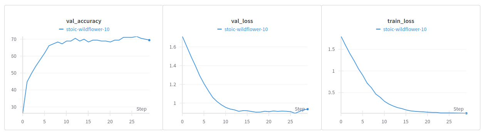

# Convomo (Part my [SIANI](https://siani.ulpgc.es/) master studies)

A deep learning project for sentiment image classification using CNN architecture.

## Overview

Convomo is a machine learning project that uses Convolutional Neural Networks (CNN) to classify sentiment in images. The project leverages Weights & Biases (wandb) for experiment tracking and visualization.

## Features

- CNN-based image sentiment classification
- Integration with Weights & Biases for experiment tracking
- GPU support for faster training
- Configurable hyperparameters
- Dataset: sentiment-images-classifier from yousefmohamed20

## Requirements

- Python 3.x
- PyTorch
- [optional] Weights & Biases
- [optional] CUDA / ROCm

## Usage

There are two notebooks in this project:
 - preprocess.ipynb: This notebook preprocesses the dataset using openCV for face detection and image resizing. Execute this notebook first to prepare the dataset for training.
 - train.ipynb: This notebook trains the CNN model using the preprocessed dataset.

 ## Results
 
 [wandb training graphs](https://wandb.ai/rtorreromarijnissen-university-of-las-palmas-de-gran-canaria/convomo/reports/Training-for-convomo-https-github-com-rtorrero-convomo---VmlldzoxMDY4ODcxNg#validation-accuracy,-validation-loss-and-training-loss)
